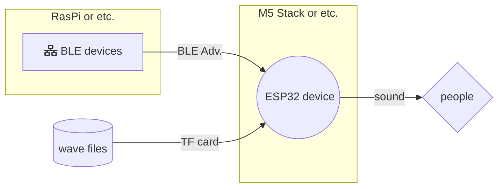
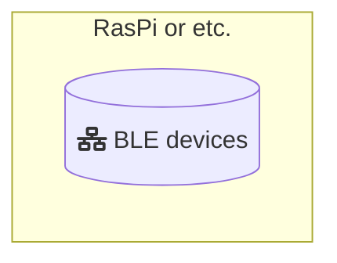
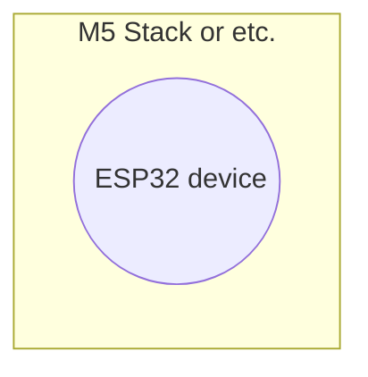

Home buzzer by BLE Central
=====================================
call families in their rooms from the home hub computer (BLE devices).




Environments
------------------------

term     | descriptions
---------|----------------
Hardware | M5 Stack as the Buzzers
Tool     | USB Type-C cable
SDK      | esp-idf v5.0
Host-OS  | Armbian 20.10 (Debian 10)
branch   | [blecent](branches/blecent)
.        | .
Hardware | RaspberryPi 3B as the home hub computer
SDK      | Python Bluez
Host-OS  | Raspibian (Debian 9)
branch   | [blecent-broker](branches/blecent-broker)
Sounds   | wave files


Setup
------------------------
- hardware: M5 Stack as Home Buzzer.
- hardware: use SBC or Linux machines has BLE devices like RaspberryPi 3B.


### Setup your BLE device



install packages for gobject and dbus.

```shell
$ apt install python3-gi python3-dbus
```

- download this repo.

```shell
$ git clone https://github.com/kuri65536/homebuzzer.git -b blecent-broker broker
$ cd broker
... optional: edit dbus policy ...
$ python3 buzzerbroker.py --type 2
```

- now your device advertise alerting and select the `2` wave file.


### Setup ESP32 device



(on the host machine)

- install esp-idf, see instruction of esp-idf:

    https://docs.espressif.com/projects/esp-idf/en/latest/esp32/get-started/linux-macos-setup.html

- my point is that specify **version number** at downloading.

```shell
(after toolchains and python setup.)
$ git clone --recursive https://github.com/espressif/esp-idf.git -b v5.0
(then go to setup esp-idf.)
```

- after setup, download this repo and build.

```shell
$ git clone https://github.com/kuri65536/homebuzzer.git
$ cd homebuzzer
$ . /path/to/esp-idf/export.sh
$ idf.py build
```

- connect M5 Stack to the host machine via USB.

```shell
$ idf.py -p /dev/ttyUSB0 flash
```

- store wave files (as you like it) to TF card,  
    and rename them to prefix single numbers:

    - 0ring.wav
    - 1bell.wav
    - 2voice.wav
    - ...

- insert TF card and reset your M5 Stack.  
    setup is completed!


----


Related documents
------------------------

### DAC peripheral
- https://docs.espressif.com/projects/esp-idf/en/v5.0/esp32/api-reference/peripherals/dac.html

### Wave file
- http://truelogic.org/wordpress/2015/09/04/parsing-a-wav-file-in-c/
- https://isip.piconepress.com/projects/speech/software/tutorials/production/fundamentals/v1.0/section_02/s02_01_p05.html


----


License
------------------------
this projects is distributed under the MIT License.


